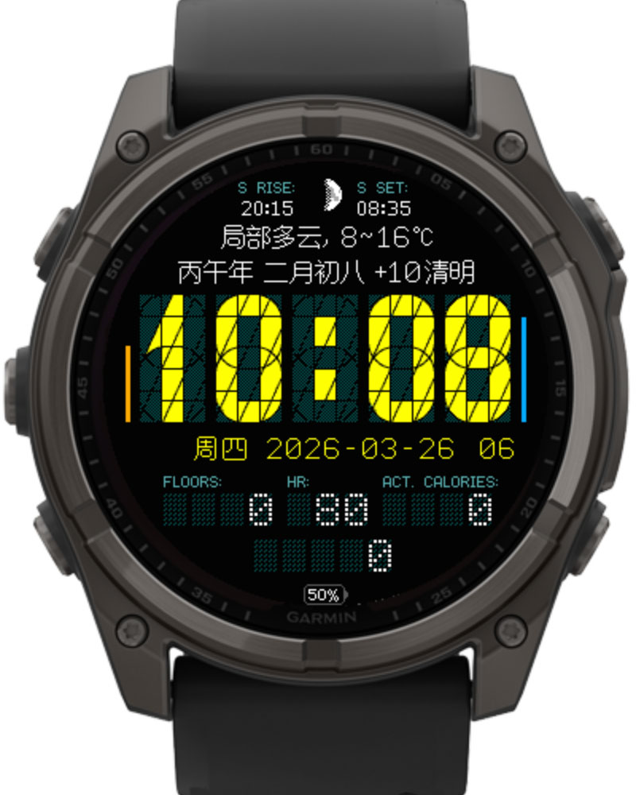

# Segment34.CN
修改自Segment34 MkII表盘([https://github.com/ludw/Segment34mkII](https://github.com/ludw/Segment34mkII))，感谢原作者开源！添加了农历和二十四节气显示，顺便对设置菜单和天气也做了汉化。由于没有制作点阵风格的汉字字体，当显示农历时请将时钟上方的字体设为“线条”（默认值），以确保能正常显示汉字。

## 更新日志 
2026年3月28日 v2.2版：  
1.修改了设置页面中的一些翻译；  
2.删除了以下几款不支持的设备：F6S、F6SP、245、945，这几款设备可以试一下精简版;  
3.增加了一种日期格式：“YYYY-MM-DD 星期”;  

2026年3月27日 v2.1版：  
时钟上面两行和下面都可以设置为显示农历；  

2026年3月26日 v2.0版：  
完成了所有汉化，包括天气和星期还有摄氏度图标；  

2026年3月25日 v1.4：  
1.将日期里面的星期显示改成了中文；  

2026年3月24日 v1.3：  
1.修复了农历字体缺失的几个字符；  
2.同步更新代码至Segment34 MkII 4.6.2；  
 
2026年3月23日 v1.2：  
1.重写了农历算法，以适应老款设备；  
2.为AMOLED屏设计了大号的字体；  
3.在设置里面增加了农历的选项菜单；  